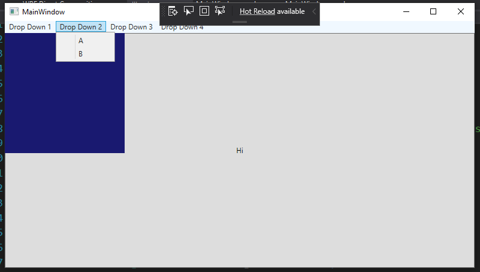

# Constant DirectX fame rate in WPF

There are two documented ways to interop DirectX with WPF
1. `D3DImage`
2. `HwndHost`

However, the frame rate in ~~each of these~~(just the `D3DImage`) method~~s~~ will be limited to WPF's variable frame rate. See [my SO question](https://stackoverflow.com/questions/63107352/background-color-artifact-in-windows-composition-engine-dwm)

~~The only~~ One way to avoid this is to use the DirectComposition API to have the Composition Engine (DWM) compose your swapchain directly on top of your WPF window.

Hit testing will just fall though.

Sizing and Positioning will require low level work not included in this sample.

The swapchain's contents are in blue:

